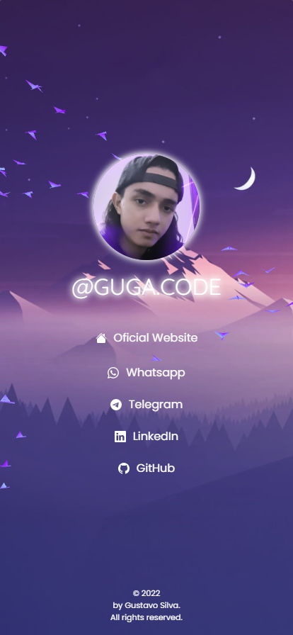

# My Bio Link | Instagram
 

<h2>Table of contents</h2>

- [Overview](#overview)
  - [The project](#the-project)
  - [Screenshot](#screenshot)
  - [Links](#links)
- [My process](#my-process)
  - [Built with](#built-with)
- [Author](#author)

<h2 id="overview"><strong>« [Overview] »</strong></h2>

<h3 id="the-project"><strong>The Project</strong></h3>

> This project is a "Link Tree" to display in the Instagram Biography.

<h3 id="screenshot"><strong>Screenshot</strong></h3>

• Layout Preview - 01  

<h3 id="links"><strong>Links</strong></h3>

- Live Site URL: [Click-me](https://gugas1lva.github.io/Bio.Link-Instagram/)

<h2 id="my-process"><strong>« [My Process] »</strong></h2>

<h3 id="built-with"><strong>Built with</strong></h3>

- Semantic HTML5 markup
- CSS custom properties
- Mobile-first workflow
- Flexbox
- [React](https://reactjs.org/) - JS library
- [Next.js](https://nextjs.org/) - React framework
- [Tailwind CSS](https://tailwindcss.com/) - For styles

<h2 id="author"><strong>« [Author] »</strong></h2>

- LinkedIn - [@GustavoSilva](https://www.linkedin.com/in/guga-silva-124706233/)
- Whatsapp - [+55 (82) 9 8182-8018](https://wa.me/558281828018) or [+55 (82) 9 8752-4230](https://wa.me/558287524230)
- Instagram - [@guga.code](https://www.instagram.com/guga.code/) | [@50repolhoscozidos](https://www.instagram.com/50repolhoscozidos/)
- Telegram - [@GugaS1lva](https://t.me/GugaS1lva)
- Email - [contatogustavosilva017@outlook.com](mailto:contatogustavosilva017@outlook.com)